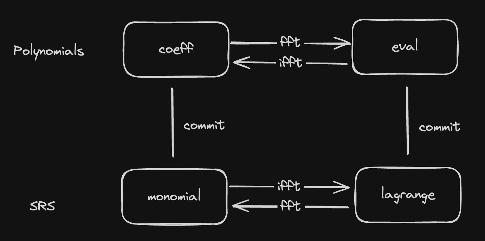

# rust-kzg-bn254

## Description

This library offers a set of functions for generating and interacting with bn254 KZG commitments and proofs in rust, with the motivation of supporting fraud and validity proof logic in EigenDA rollup integrations.

## Warning & Disclaimer

This code is unaudited and under construction. This is experimental software and is provided on an "as is" and "as available" basis and may not work at all. It should not be used in production.

## Setup for testing

1. To test, please download the provided G1 and G2 points from [DA Resources](https://github.com/Layr-Labs/eigenda/tree/master/inabox/resources/kzg),
2. Specify these files in the `kzg.setup()` function, leave the `g2_power_of2_path` empty, and specify `srs_order` to be 3000.

## Configuring with the EigenDA KZG trusted setup

1. Follow the setup instructions to download the G1 and G2 powers of 2 points from the [Operator Setup Guide](https://github.com/Layr-Labs/eigenda-operator-setup)
2. Specify the files in `kzg.setup()` function, leave the `g2_points` empty, and specify the `srs_order` per the guide.
3. Note that this is process will take a few minutes to load since it is a bit intensive.

## Quick Start

See the `test_compute_kzg_proof` function in [./tests/kzg_test.rs](./tests/kzg_test.rs#) for an end to end usage of the library.

## Requirements

1. SRS points required are in the same format as provided by EigenDA.
2. Committing is performed in Lagrange format. The required IFFT is done within the function and is not required to be performed separately.
3. For proof generation, the data is treated as evaluation of polynomial. The required (I)FFT is performed by the compute function and is not required to be performed separately.

## Library Design / Architecture

The main purpose of this library is to allow taking a piece of data, committing to it, and then generating and verifying proofs against that commitment.

### Data Types

The main data pipeline goes: 
> user data -> Blob -> Polynomial -> KZG Commitment / Proof

- User Data: bytes array
  - meaningful to users (typically will be a rollup batch)
- Blob: bn254 field elements array
  - meaningful to EigenDA network
  - Obtained from User Data by inserting zeroes every 31 bytes to make every 32 byte an element of bn254.
- Polynomial: bn254 field elements array, interpreted as coefficients or evaluations of a polynomial
  - meaningful when committing and generating/verifying proofs
  - Obtained from Blob by appending zeroes to make the length a power of 2, and then interpreting the array as coefficients or evaluations of a polynomial.
- Kzg: struct storing the SRS points used to generate commitments and proofs
- SRS points: bn254 group elements
  - inner producted with the polynomial to generate commitments

The [Blob](./src/blob.rs) and [Polynomial](./src/polynomial.rs) structs are mostly [Plain Old Data](https://en.wikipedia.org/wiki/Passive_data_structure) with constructor and few helper methods. The interesting stuff happens in the [KZG](./src/kzg.rs) struct, which has methods for committing to a blob, polynomial in coeff or eval form, and generating and verifying proofs.

Our current codebase has the types PolynomialEvalForm and PolynomialCoeffForm to represent the polynomial in evaluation and coefficient form respectively. However, we do not have types to represent the two forms of srs points. They are implicitly assumed to be in monomial form when loaded, and an IFFT is performed before taking the inner product with the polynomial in evaluation form.

### KZG Commitments

Below diagram explains the different types involved between polynomials, SRS points, and KZG commitments.
A KZG commitment can be taken by an inner product between (poly_coeff, srs_monomial) or (poly_eval, srs_lagrange). FFT and IFFT operations can be performed to convert between these forms.

### KZG Proofs

TODO: Add diagram for KZG Proofs
